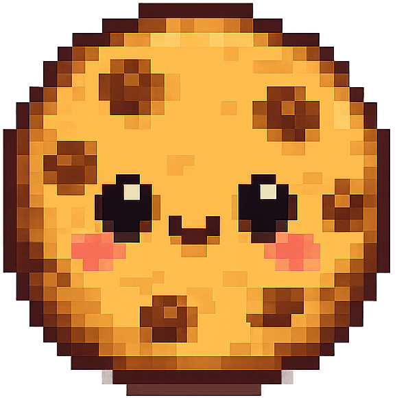
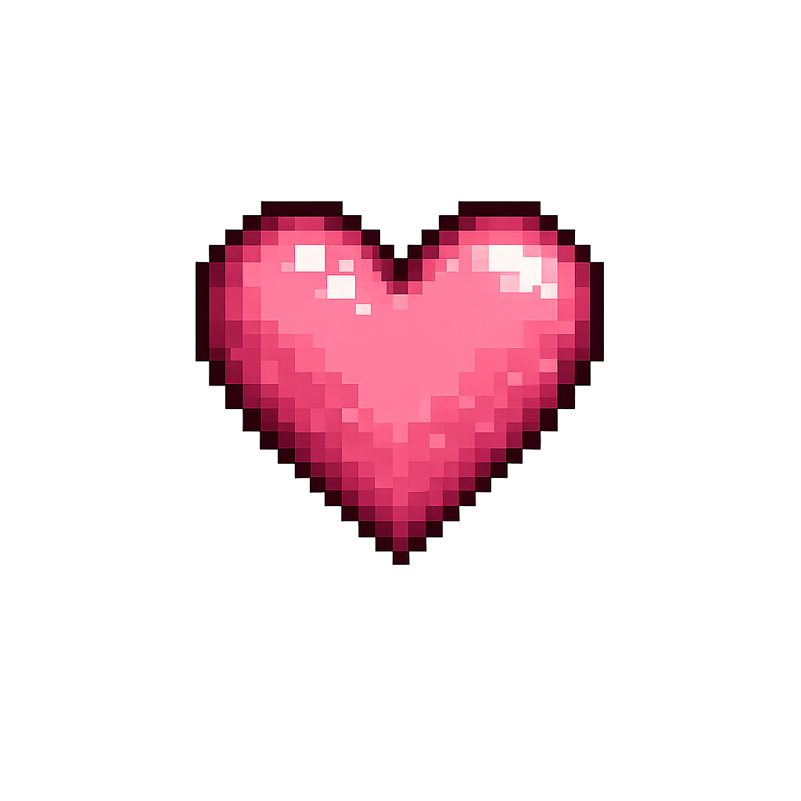
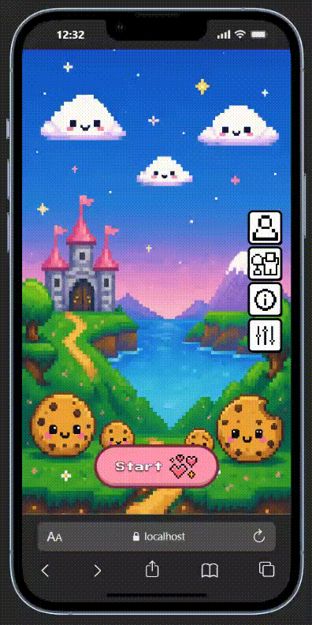

<div align="right">
  <sub><a href="README.md">Español</a> · English</sub>
</div>

<div align="center">
  

  # Accept All Cookies

  ### A cookie banner that will do everything in its power to stop you from clicking "Agree" (◞‸◟)

  **[▶ Play on GitHub Pages](https://s-minaya.github.io/accept-all-cookies/)**

  　　
</div>

<br />

## Demo

<div align="center">
  
</div>

<br />

## Why I built it ♡

Everyone has closed a cookie banner without reading it — click, click, next, without thinking. This
project started by flipping that all-too-familiar friction around: instead of suffering the *dark
pattern*, you play it.

The concrete spark came right after finishing **Programa con Agentes**, by **BIG School**. I wanted a
real project to apply what I'd learned — not a class exercise, but something entirely mine, thought
through, designed and actually played end to end. And then I remembered ***Doki Doki Action Game***:
one of those moments where you're watching something and you think *"hmmm... this could totally be
built"* (灬º‿º灬)♡. So I got to work.

I like taking care of my projects: I draw the icons, the characters, the landing screens myself — I'm
not satisfied with something that just *works*, I want it to feel cared for. And since I love video
games and I love programming, this project was the perfect excuse to bring both together into
something with a point: twelve levels, twelve real interface-manipulation techniques — the button
that moves, the "Agree" hidden among identical twins, the countdown that punishes hesitation — each
one turned into a puzzle you have to deliberately disarm.

Technically, it was also the perfect excuse to build something small but *actually finished*: twelve
different mechanics are twelve different interaction problems (physics, timing, animation, shared
state) inside the exact same strict visual rules — and to document the whole process with Spec Driven
Development instead of improvising as I went.

<br />

## Stack ⋆｡°✩

- **React 18** + **TypeScript** (strict) on **Vite**.
- **Zustand** for global state (run, settings, ranking, character), persisted to `localStorage`.
- **matter.js**, only in levels 3 and 4 (the falling-Disagree rain and the Plinko board), imported
  dynamically inside its own chunk — the rest of the game never loads it.
- **Sass** (CSS Modules + BEM) — zero CSS-in-JS, zero utility framework.
- **Vitest** + **Testing Library** for logic and components; **Playwright** for real-browser QA
  (responsive, touch, accessibility).
- **GitHub Actions** → **GitHub Pages**, a fully static build, no backend.

<br />

## Features ✧

- **12 levels, 12 distinct mechanics** — no reused templates with different skins:
  - Real physics with `matter.js` (a rain of rejections you have to dodge; a Plinko board that decides your fate).
  - An arrow-chain board with a **single verified solution, checked by a script** (`spec/tools/validate-level6.mjs`).
  - A slot machine with scroll-physics reels and unlimited retries until you land it.
  - A shell game with 12 buttons shuffled live, where the animation and the "truth" can never disagree.
  - A window that duplicates the first time you drag it (after that, dragging just moves it), up to 7 identical copies.
  - An interrogation by Sans, from Undertale, with a looping voice and a pattern that breaks exactly when you let your guard down.
  - A theatrical progress bar that punishes compulsive clicking.
- **A complete meta-flow**: character selection, a local ranking, linear progression with a full reset
  on defeat, a credits screen with confetti 🎉.
- **Full Spanish / English**, including the deliberate joke that "Agree"/"Disagree" are *identical* in
  both languages (part of one level's actual mechanic, not an oversight (¬‿¬) ).
- **100% responsive**, from an iPhone SE to a 1920px monitor, with real touch parity: everything
  playable with a mouse has an exact touch equivalent.
- **`prefers-reduced-motion` respected** in the decorative animations, without changing a single game rule.
- A network error while loading a level shows an XP-styled warning with an exit, never a blank screen.

<br />

## Installation and local setup ⌨︎

```bash
git clone https://github.com/s-minaya/accept-all-cookies.git
cd accept-all-cookies
npm install

npm run dev      # local dev server (Vite)
npm run test     # Vitest
npm run lint     # ESLint + Prettier
npm run build    # production build (includes a bundle-hygiene check)
```

<br />

## Folder structure ⌇

```
accept-all-cookies/
├── spec/                    # Spec Driven Development: the project's source of truth
│   ├── constitution/        #   mission, stack, roadmap — the rules that don't change per feature
│   ├── features/            #   spec + plan + tasks for each of the 17 features
│   ├── assets/               #   the GDD (the full game design) and the verified level 6 board
│   └── tools/                #   validation scripts (the level 6 board, build hygiene)
├── src/
│   ├── levels/               # one self-contained directory per level (level01 … level12)
│   │   └── levelNN/          #   component + testable pure logic + styles, lazy-loaded
│   ├── app/                  # game shell: state-based routing, win/lose flow
│   ├── components/           # the design system (xp/, cute/), reused across the whole game
│   ├── state/                # Zustand stores + the only layer allowed to touch localStorage
│   ├── i18n/                 # ES/EN dictionaries
│   └── playground/           # design-system harness, development only (?playground)
└── .github/workflows/        # build + test + automatic deploy to GitHub Pages
```

<br />

## Interesting technical decisions 🔧

- **A single level → shell channel (`hostChannel.ts`)**: no level ever touches the window, the
  countdown or navigation directly. It publishes its board and its buttons through a handful of typed
  slots, and the shell decides how and when to actually mount them. Adding a new level never means
  touching the shell.
- **Level 6's board is hand-authored and verified by a separate script**
  (`validate-level6.mjs`): it checks that the board has a single solution, that no arrow chain leaves
  the board or loops forever, and that the player can never get stuck. Editing the board without
  running the validator is against the repo's own convention.
- **One JS chunk per level, lazy-loaded**: only the active level is ever mounted in the DOM;
  `matter.js` (~85KB) lives in a shared chunk that only levels 3 and 4 ever download. The rest of the
  game never touches it.
- **Animations by reference, not by React state**: levels with continuous motion (slot reels, dragged
  windows, the shell game's shuffle) write their position straight to the DOM via `ref`/CSS custom
  properties on every `requestAnimationFrame` tick, instead of triggering a React render 60 times a
  second. `paused` is resolved by simply not writing anymore — no special "frozen" state needed.
- **Logical resolution + scale, not per-breakpoint responsive CSS**: every game area with physics or a
  board is designed on a fixed logical canvas, and the shell scales the whole thing with
  `transform: scale()` to match the real viewport. Physics and coordinates never need to know which
  screen they're on.
- **Every "rigged" mechanic is a pure, tested function**: the shell game's shuffle, level 12's trap
  script, the arrow board's solution… none of it lives inside an unreproducible `useEffect`. It can be
  verified without ever opening a browser, and it is: 600+ tests.

<br />

## How it was built: SDD + Claude Code ⚙︎

The whole project followed **Spec Driven Development**: nothing got coded before it existed, in
`spec/features/NNN-name/`, as a `spec.md` (what it does and why), a `plan.md` (how it's implemented,
what got discarded and why) and a `tasks.md` (the breakdown, checked off as it was completed). The
game's entire design — every mechanic, text, color and win/lose condition — lives in a single
document, the GDD (`spec/assets/accept-all-cookies-gdd.md`), which has final say over the code: any
time they disagreed, work stopped to ask instead of improvising an interpretation.

This repository was built together with **Claude Code**, with explicit rules written down
(`AGENTS.md`) instead of loose instructions every time: coding conventions, hard limits on the stack
(what's allowed to use physics, where each thing lives, what never gets hardcoded) and the SDD
workflow itself. What got delegated was the feature-by-feature implementation on top of already-approved
specs, the test suite, and the Playwright QA rounds (responsive, touch, accessibility). What stayed in
my own hands: every design and mechanic decision (the GDD is mine), every checkpoint played and
approved by hand before closing a feature, and the final word on anything touching how the game
*feels* to play. The result isn't "until it compiles" — every one of the 17 features has its own
real, played review round, many with two, three or four rounds of adjustments until the trick landed
right.

<br />

## Roadmap ⋆⭒˚｡⋆

- **More levels.** 12 is the starting point, not the ceiling — the shell and `hostChannel` are already
  built so adding a new level means "write the mechanic," not "touch half the game." The backlog of
  dark-pattern ideas is already longer than the current game.
- **Random level order between runs**, so every playthrough feels different even for someone who
  already knows it by heart.
- **More playable characters**, hand-drawn like the rest of the game's art — I want picking a
  character to be a decision with personality, not a skin picker.
- **Original sound and music.** Right now every sound is pulled from a royalty-free site; my best
  friend is a composer and is already thinking about something...
- **Extended accessibility** beyond `prefers-reduced-motion`: full keyboard navigation and
  screen-reader support across the meta-flow (menus, ranking, credits).

<br />

## Credits and inspiration ⁺˚*･༓☾

Inspired by ***Doki Doki Action Game***.

Special appearance: **Sans © Toby Fox** (*Undertale*) — a non-profit tribute.

<br />

## Contact ✉︎

- LinkedIn: [linkedin.com/in/sofia-minaya](https://www.linkedin.com/in/sofia-minaya/)
- Portfolio: [s-minaya.github.io/sofia-minaya-portfolio](https://s-minaya.github.io/sofia-minaya-portfolio/)
- Email: minaya.sofia@gmail.com

<div align="center">
  
  <br />
  <sub>╰(*≧ω≦*)╯ thanks for reading all the way down here — now go try to click "Agree"</sub>
</div>
